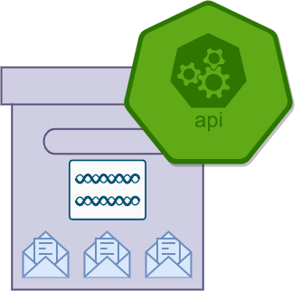

# Raffle API ENDPOINT

This is an implementation for a REST-API for hosting raffles.



## Stack

```

+----------------+
|   Raffle BOT   |     
+----------------+
        |
+----------------+
|   Raffle API   |     
+----------------+
        |
+----------------+
|    MongoDB     |
+----------------+

```

## Deploy via DOCKER

```Dockerfile

dsdasds
dsdasds
```

## Endpoints

- GET
- PUT
- POST
- DELTE

## Configuration

Environment variables:

```env
SERVER_IP=0.0.0.0
SERVER_PORT=8080
MONGODB_URI=mongodb://<USERNAME>:<PASSWORD>@localhost:27017
SOL_WALLET=<SOLANA_WALLET_TO_CHECK>
# The following are used to validate tickets
CHECK_RAFFLE_EXISTS=true
CHECK_RAFFLE_RUNNING=true
CHECK_RAFFLE_TIME=true
CHECK_RAFFLE_DESTINATION=true
CHECK_RAFFLE_USED_SIGNATURE=true
CHECK_TOKEN_SYMBOL=true
CHECK_TX_STATUS=true
```

### Notes

- [cargo_chef_sample](https://www.lpalmieri.com/posts/fast-rust-docker-builds/)

mkcert -key-file key.pem -cert-file cert.pem 127.0.0.1 localhost


